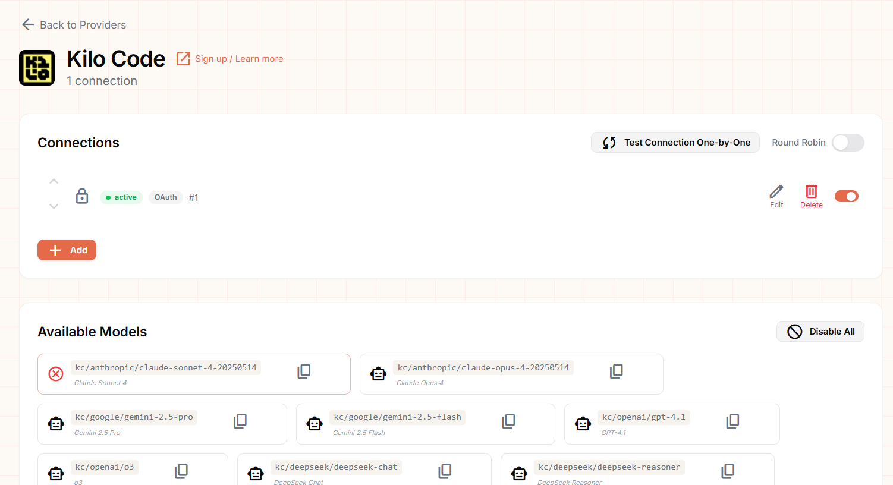
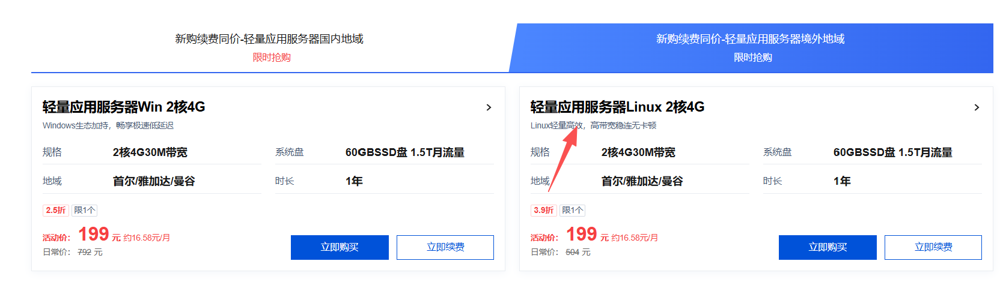
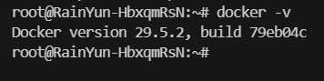
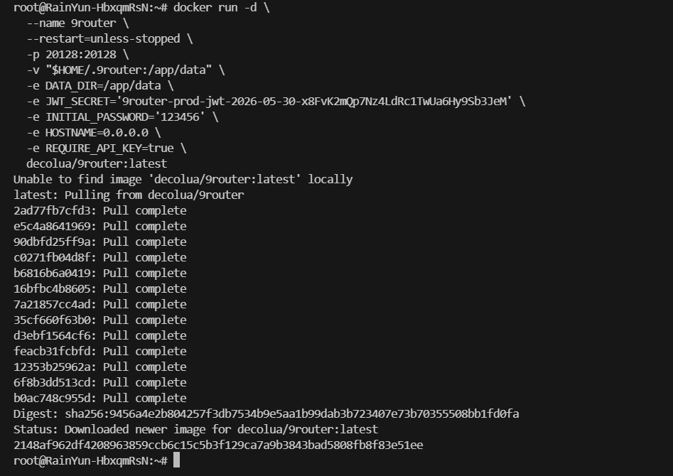
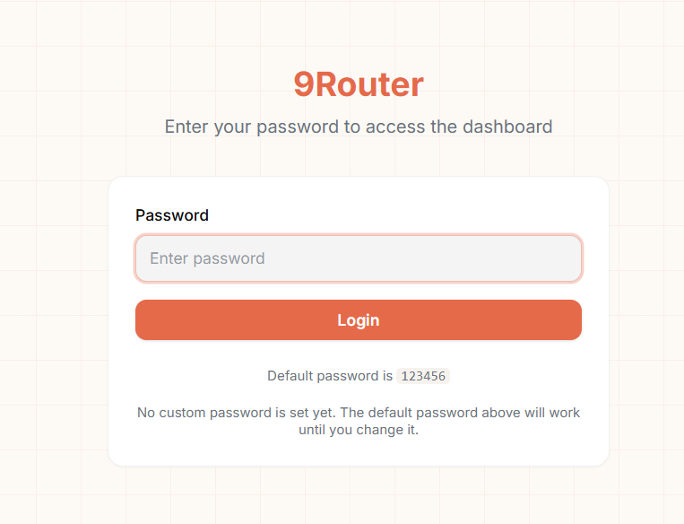
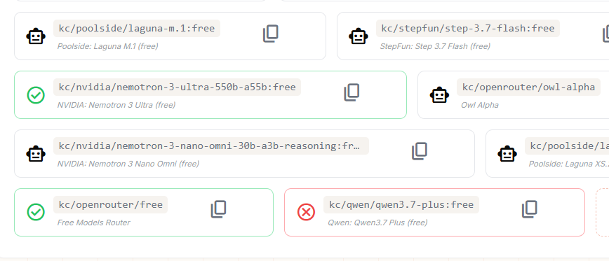
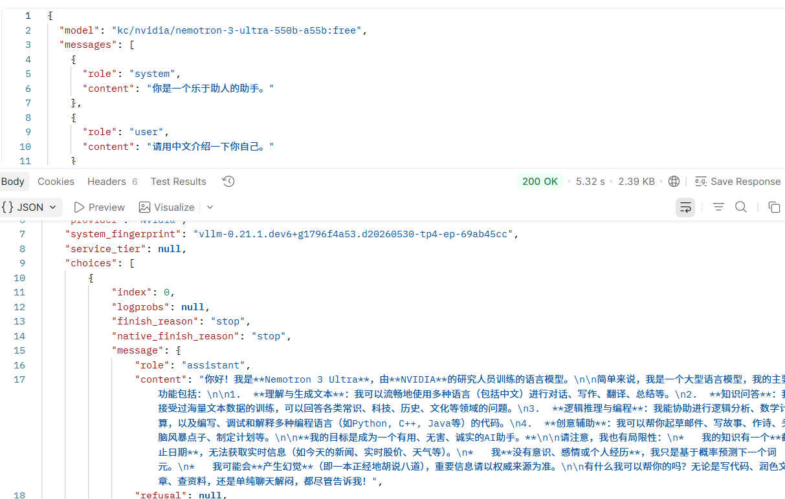

Kilo提供免费的大模型，但是没API，就需要反代把它提取成API



项目地址：https://github.com/decolua/9router

推荐服务器部署，不要选择国内地区，选择Linux版本Docker上手快

腾讯云新加坡，硅谷，东京地区价格是199元一年，2核4G30M带宽，60GBSSD盘 1.5T月流量，推荐首尔线路↓↓↓，系统选Ubuntu24

购买地址：https://curl.qcloud.com/oyWDLkRJ



**教程**

1.ubuntu24系统安装Docker

```
sudo apt update
sudo apt install -y ca-certificates curl gnupg
sudo install -m 0755 -d /etc/apt/keyrings
curl -fsSL https://download.docker.com/linux/ubuntu/gpg | sudo gpg --dearmor -o /etc/apt/keyrings/docker.gpg
sudo chmod a+r /etc/apt/keyrings/docker.gpg
echo \
"deb [arch=$(dpkg --print-architecture) signed-by=/etc/apt/keyrings/docker.gpg] https://download.docker.com/linux/ubuntu \
$(. /etc/os-release && echo "$VERSION_CODENAME") stable" | \
sudo tee /etc/apt/sources.list.d/docker.list > /dev/null
sudo apt update
sudo apt install -y docker-ce docker-ce-cli containerd.io docker-buildx-plugin docker-compose-plugin
sudo docker run hello-world
```



2.docker部署项目

推荐设置一个强密码

```
suod docker run -d \
  --name 9router \
  --restart=unless-stopped \
  -p 20128:20128 \
  -v "$HOME/.9router:/app/data" \
  -e DATA_DIR=/app/data \
  -e JWT_SECRET='换成超长随机字符串' \
  -e INITIAL_PASSWORD='换成强密码' \
  -e HOSTNAME=0.0.0.0 \
  -e REQUIRE_API_KEY=true \
  decolua/9router:latest
```

示例命令可以直接复制，推荐修改密码

```
sudo docker run -d \
  --name 9router \
  --restart=unless-stopped \
  -p 20128:20128 \
  -v "$HOME/.9router:/app/data" \
  -e DATA_DIR=/app/data \
  -e JWT_SECRET='9router-prod-jwt-2026-05-30-x8FvK2mQp7Nz4LdRc1TwUa6Hy9Sb3JeM' \
  -e INITIAL_PASSWORD='123456' \
  -e HOSTNAME=0.0.0.0 \
  -e REQUIRE_API_KEY=true \
  decolua/9router:latest
```



3.浏览器访问，防火墙放通20128 端口
  
```
http://你的服务器IP:20128
```



4.Providers选择Kilo Code，我这里选择的模型是kc/nvidia/nemotron-3-ultra-550b-a55b:free



5.调用测试成功

接口：http://你的服务器IP:20128/v1

模型：kc/nvidia/nemotron-3-ultra-550b-a55b:free


